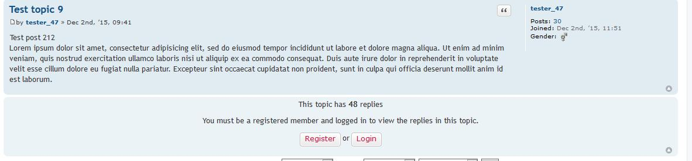

Show First Post Only to Guest
===============

phpBB 3.1 Show First Post Only to Guest extension

Allows the admin to set an option that will only allow unregistered users/guests to view the first post of any topic. The rest of the posts in the topic will ask them to login or register.  Options are set by the admin on a per forum basis.

[](https://travis-ci.org/RMcGirr83/phpBB-3.1-sfpo)



## Installation

### 1. clone
Clone (or download and move) the repository into the folder ext/rmcgirr83/sfpo:

```
cd phpBB3
git clone https://github.com/RMcGirr83/phpBB-3.1-sfpo.git ext/rmcgirr83/sfpo/
```

### 2. activate
Go to admin panel -> tab customise -> Manage extensions -> enable Show First Post Only to Guest


## Update instructions:
1. Go to your phpBB-Board > Admin Control Panel > Customise > Manage extensions > Show First Post Only to Guest: disable
2. Delete all files of the extension from ext/rmcgirr83/sfpo
3. Upload all the new files to the same location
4. Go to your phpBB-Board > Admin Control Panel > Customise > Manage extensions > Show First Post Only to Guest: enable